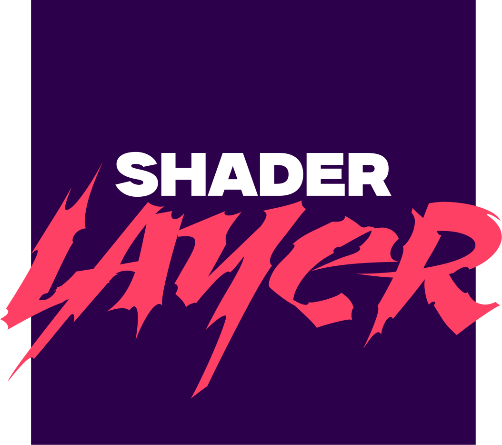
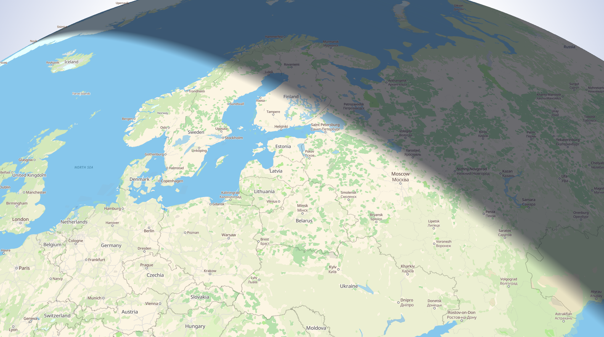
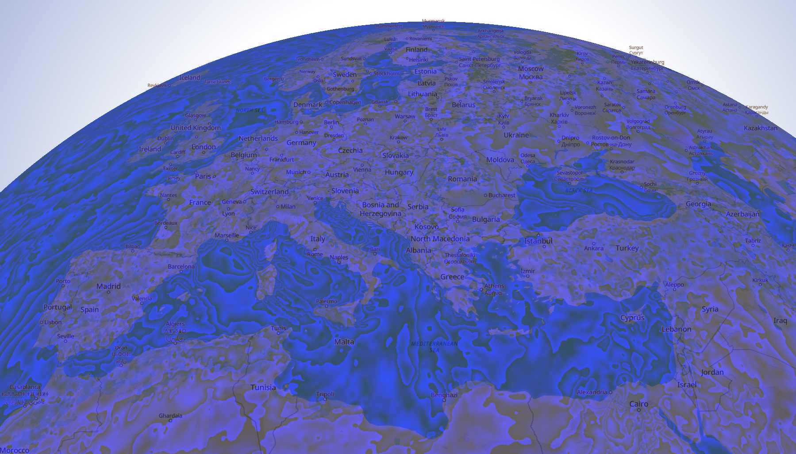
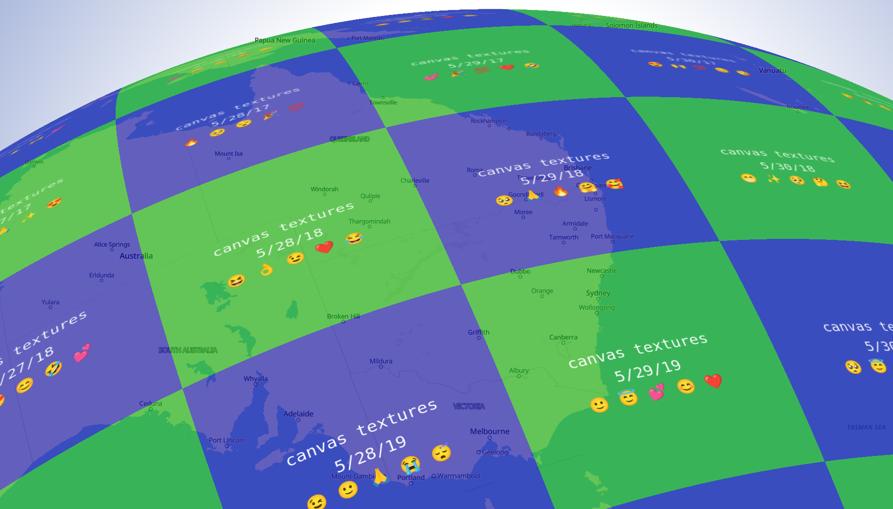
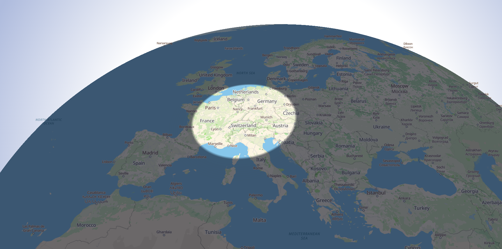
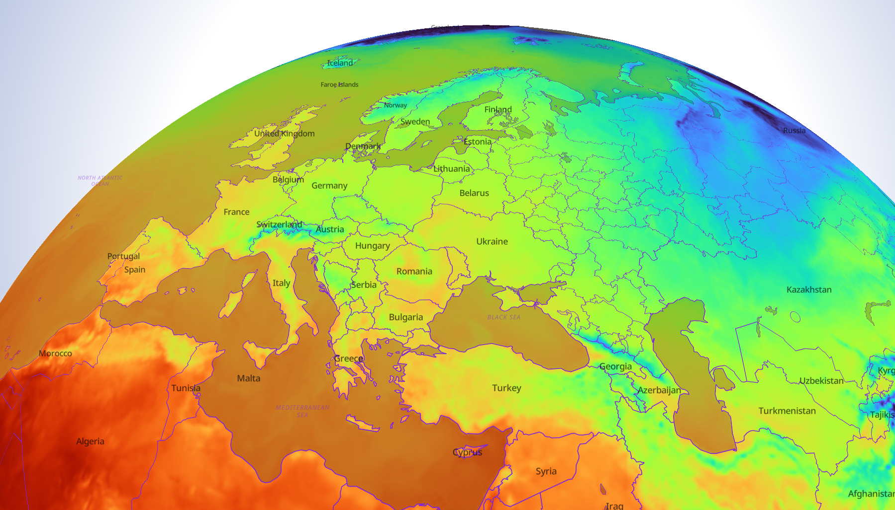

<p align="center">
  
</p>

<p align="center">
  </img>
</p>

The library `maplibre-gl-shader-layer` provides the building blocks to easily create your own tiled layers for MaplibreGL JS using WebGL and shader code with hooks to tune uniforms for each tile.   
Under the hood, it's using ThreeJS to make it even easier to get started.

Install it with:
```
npm install maplibre-gl-shader-layer
```

Then, you can use one of the built-in layers or create your own in a few steps!

## Core tools

### `Colormap` and `ColormapDescriptionLibrary`
The colormap module is not directly related to the layer logic and is instead a transverse component that can be handy for data visualization.  

The `Colormap` constructor is **not** to be called directly and instead, the static factory function `Colormap.fromColormapDescription(colormapDescription, scaling)` must be used. As in the foloowing:

```ts
const colormap = Colormap.fromColormapDescription(ColormapDescriptionLibrary.turbo, { min: -25, max: 40, reverse: false });
```

The module `ColormapDescriptionLibrary` contains descriptions for many popular colormaps (blackbody, viridis, inferno, etc.) that are all scaled in the interval [0, 1]. The `scaling` will adjust the provided description to new bounds and optionnaly reverse the colormap.

While this module contains already many colormaps, it's quite easy to create a custom description:
```ts
const lagoonDescription = [
  0,   "#1a3a5c",
  0.2, "#2d5f7c",
  0.4, "#4a8a9c",
  0.6, "#7ab5ac",
  0.8, "#b0d8b4",
  1,   "#e8f5d8"
];

const lagoonColormap = const colormap = Colormap.fromColormapDescription(lagoonDescription);
```

A Colormap instance exposes several methods:
- `getRgbColorAt(...)`: get a color for a specific value
- `createCanvasElement(...)`: get a Canvas representation of the colormap (handy for legend)
- `createImageBlob(...)`: get a PNG image blob of the colormap (handy for legend)
- `createImageObjectURL(...)`: get the URL to an image blob (handy for legend)
- `getLabels(...)`: get the labels (handy for legend)
- `getRange()`: get the range of the colormap
- `getTexture(...)`: get a webGL/ThreeJS texture representation of the colormap


### `RemoteTileTextureManager`
An instance of `RemoteTileTextureManager` is encapsulating the logic of fetching a tile texture based on a URL pattern such as `https://example.com/{z}/{x}/{y}.png`. In addition to the fetching, it also contains a cache and the logic to turn an image into a compatible WebGL texture. As a result, even thought it is by no means mandatory to use, it is still handy to rely on it to create a textures pool from distant tile files.

You can find a usage of it in [RemoteTextureTiledLayer](src/lib/layers/RemoteTextureTiledLayer.ts).

### `TileTextureManager`
An instance of `TileTextureManager`, is also encapsulating some texture creation and caching logic, but contrary to `RemoteTileTextureManager`, a texture-creation function (async) must be provided to the `.getTexture(...)` method to instruct how to generate the texture in case it's not already in cache.

You can find a usage of it in [CanvasTextureTiledLayer](src/lib/layers/CanvasTextureTiledLayer.ts)

### Extra tools
Some extra functions can be found in the [tool.ts](`lib/core/tools.ts`) file, for instance about coordinate conversions or tile logic. These used by core logic but can also be handy for custom layers.


## Built-in layers
### `BaseShaderTiledLayer`
The class `BaseShaderTiledLayer` is the one to inherit from when creating a new type of layer. It contains all the logic to:
- create WebGL tile polygons for each tile visible on the viewport
- instanciate a proper layer, following the Maplibre GL JS recommandations
- hook the proper rendering functions to sync with Maplibre

The class `BaseShaderTiledLayer` is designed to be extended and not to be used as is. The simplest example of an extension would be (DummyGradientTiledLayer)[src/lib/layers/DummyGradientTiledLayer.ts].

Since all the layers, built-in or homemade, inherit from `BaseShaderTiledLayer`, they come with some methods:
- `.setVisible(v: boolean)` : toggle the layer visibility. If made invisible, the layer is no longer rendered and all its internal necessary for rendering are no longer called.
- `.setOpacity(opacity: number)` : set the opacity of the layer with a value in [0, 1]. For homemade layers, this only updates the uniform `opacity` to be used in the fragment shader (more on that in the section [implement-your-own-tiled-layer](#implement-your-own-tiled-layer))
- `.setAltitude(altitude: number)` : by default, the altitude is 0, if the maps does not have any terrain enabled, the custom layer lays flat (or round when globe) at the surface of the map. If the altitude is higher, the layer with float above ground. The value is supposedly in meters but because of projections this is not to be taken as a precise altitude.


### `DummyGradientTiledLayer`
The (DummyGradientTiledLayer)[src/lib/layers/DummyGradientTiledLayer.ts] is an example of how to extend `BaseShaderTiledLayer`. An actual demo can be found at [dummy.ts](src/demos/dummy.ts). 
  
This demo is minimalist as it only 


### `DaylightTiledLayer`
The `DaylightTiledLayer` adds a day/night light parametric to a given `Date` instance if provided (otherwise it uses the curent data). A colormap can optionnaly be provided and is in function of the sun altitude angle in degree compared to horizon, where:
- `-90` is the sun position at nadir (the maximum below the horizon, the most night that night can be)
- `0` is exactely at the level of horizon
- `90`is the sun position at zenith, the highest position in the sky

The color maps does not have to cover the whole [-90, 90] interval and could only cover a range of interest [-5, 5] that would cover the transition from day to night.  

 
A usage example of `DaylightTiledLayer` can be found in [daylight.ts](src/demos/daylight.ts).

### `RemoteTextureTiledLayer`
An instance of `RemoteTextureTiledLayer` is just adding a raster tiled layer, with tiled fetch from a URL pattern like `https://example.com/{z}/{x}/{y}.png`.  
Since this kind of feature is already well supported in Maplibre, this layer is rather for demo purposes on how to create a new type of layer that leverages a `RemoteTileTextureManager`. So, consider it more like learning material.

Look at the source of [RemoteTextureTiledLayer.ts](src/lib/layers/RemoteTextureTiledLayer.ts).

### `CanvasTextureTiledLayer`
An instance of `CanvasTextureTiledLayer` opens the possibility to provide a canvas to each tile. The contructor takes an options named `canvasMaker`, a function with the signature:
```ts
(tileIndex: TileIndex) => Promise<HTMLCanvasElement | OffscreenCanvas>;
```
It takes a tile index (`{z: number, x: number, y: number}`) and spits out a Promise to a canvas or OffscreenCanvas instance. Internally, the call to the canvasMaker function is awaited to provide a greater flexibility.


Look into [this demo](src/demos/canvastexture.ts) to see how `CanvasTextureTiledLayer`is being used.

### `DistanceTiledLayer`
This layer is also nice as learning material, but can possibly be usefull for actual situation. This layer let's you define a radial pattern around a position. It's useful to create a focus zone, with the out-of-focus zone being slightly darker. But since what you provide is a position (the center) and a colormap that has distances in km as data stops, then you can also create a radial rainbow that would symbolize the iso distance from a reference point. Once the layer is monted, you can update the reference position and/or the colormap.


Look into the demo [distance.ts](src/demos/distance.ts) to see how the colormap is generated.

### `MultiChannelSeriesTiledLayer`
The `MultiChannelSeriesTiledLayer` is probably the most advanced built-in layer available here. Let's unpack the reasons it's named like that:
- **"multi-channel"** stands for the fact that it's fed by RGB(a) raster tiles such as PNG or WebP but that color channels are **not** representing colors, but instead can be combined to encode a 16 or 24 bit precision metric.
- **"series"** stands for the capability of interpolating the rendering along an arbitrary axis, be it time, depth, altitude, or anything
- **"tiled layer"** because it's a layer that is tiled.

There are other aspect of `MultiChannelSeriesTiledLayer` that could not be captured in the name, among those:
- values can be encoded with unsigned integers with depth 8 bits, 16 bits or 24 bits depending if encoded on 1, 2 or 3 channels
- integer values are then scaled and offset using the properties `polynomialSlope` and `polynomialOffset` that are common accros an entire series (more on that later). This is to go from encoded values to values in real world unit.
- the alpha channel (if present) is used to capture `nodata` (when equal to `0`). That resuls in a pixel not being redered (fully transparent)
- the color rendering is done using colormaps, that take data points in real world units
- the series is as long as needed but can also contain a single element
- the pixel values can be given a dimension name (eg. "Temperature") and a unit (eg. "°C")
- the series axis can be given a name (eg. "Depth") and a unit ("meter")
- each element of the series has:
  - its dedicated tileset
  - its position along the series axis, captured by the property `seriesAxisValue`
  - its own optional metadata

All the fields of the payload are captured by the style definition `MultiChannelSeriesTiledLayerSpecification` from [MultiChannelSeriesTiledLayer.ts](src/lib/layers/MultiChannelSeriesTiledLayer.ts), but the easied to get a good understanding is probably to look at the [sample JSON payload](public/demo-tilesets/temperature_2m/index.json) from the [temperature data](public/demo-tilesets/temperature_2m) used for the [temperature example](src/demos/weather.ts).




#### Tile encoding
The raster encoding used for `MultiChannelSeriesTiledLayer`, as briefly mentioned above, is leveraging up to 3 color channels to provide high precision data visualization (or visualization of high precision data, as you prefer). If you are familiar with Mapbox's [Terrain-RGB](https://docs.mapbox.com/data/tilesets/reference/mapbox-terrain-rgb-v1/), then it's very close in practice!

While Terrain RGB has:
```bash
height = -10000 + ((R * 256 * 256 + G * 256 + B) * 0.1)
```

`MultiChannelSeriesTiledLayer` has:
```bash
# 'value' being in real world unit
value = polynomialOffset + ((R * 256 * 256 + G * 256 + B) * polynomialSlope)
```

which is essentially a generic way to do the same thing, and that can also be used on only 1 or 2 color channels:
```bash
# With only 2 channels: G and B
value = polynomialOffset + ((G * 256 + B) * polynomialSlope)
```

```bash
# With only 1 channel: B
value = polynomialOffset + (B * polynomialSlope)
```

The option `rasterEncoding.channels` lets you define which channels are used and in what order (eg. `"rgb"`, `"gb"`, `"bgr"`, `"b"`, etc.).

The `polynomialOffset` is handy to capture data range that does not start at 0. For instance, air pressure in Pascal are typically measured at mean sea level in a range [90600, 108000], and leaving room to encode the first 90600 would really be a waste of data. More generally, `polynomialOffset` will be the first value of your range, it could be `90600` for air pressure, or it could be `-60` for making sure you can capture -60°C temperature. It is always in real world unit.

The `polynomialSlope` is used to capture the encoding step, also in real world unit, and this depends on your use case. Do we want to encode steps from `90600` to `90600.1`? Then `polynomialSlope` should be `0.1`. If we want to have a 0.01 precision step, then `polynomialSlope` should be `0.01`.

Let's see an example more in depth. Weather data is usually in float32, tiles are RGB(a) with uint8 on each channel.
- R: 8 bits
- G: 8 bits
- B: 8 bits

Let’s use the RGB channels to encode uint24 and keep the alpha channel to flag nodata. But... air pressure in Pascal can range from 90600Pa to 108000Pa, let’s not encode the first 90600 values! To solve this, let’s keep in the metadata:
- An offset (90600) (aka. `polynomialOffset`)
- A precision step (eg. 0.1 if we want to be jump from 90600 to 90600.1) (aka. `polynomialSlope`)

Now, let’s encode the value `108000`, the max value from our range of interest, with an offset of 90600 and a step of 0.1:

- Raw value as uint24: (108000 - 90600) / 0.1 = 174000

And on each channel:
- R = 174000 >> 16 = 2
- G = (174000 >> 8) & 0xFF = 167
- B = 174000 & 0xFF = 176

One thing to be careful of is to find the right balance between the range and the precision. If the range is too wide and the precision step is too small, the value will overflow.  

A good rule of thumb is that the max raw value (174000) should be strictly smaller than:
- **256** if using 1 channel
- 256^2 = **65536** is using 2 channels
- 256^3 = **16777216** is using 3 channels

In our case (174000) it was the right choice to use 3 channels.

If it's greater than those values, then use a coarser precision step (larger `polynomialSlope` value) or narrow the numerical range you want to represent (for instance, temperatures don't always need to be captured in the range [-60, 80] but [-30, 50] may be enough).

The values of `polynomialSlope` and `polynomialOffset` are common across the entire layer, meaning those settings apply to all the tilesets that make the series.

## Implement your own tiled layer
To create your own tiled layer, you have to:
- extend from the class `BaseShaderTiledLayer`
- implement the method `onSetTileShaderParameters(...)`, to provide new tiles with some meterial config (*fragment shader*, *uniforms*, *defines*, etc.)
- implement the method `onTileUpdate(...)` called just before rendering each tile to update uniform values
- write your own fragment shader, possibly reussing the built-in uniforms and varyings

To get some inspiraration, [DistanceTiledLayer](src/lib/layers/DistanceTiledLayer.ts) is a good example as it's a bit more than the bare minimum, yet is not too complex.

Here are all the built-in **uniforms**, prefixed `u_`, that `BaseShaderTiledLayer` adds for you and that are alway accessible from your fragment shader:
- `float u_opacity` : updated whenever the method `layer.setOpacity(...)` is called, the value is in the range [0, 1]. Your choice to make use of it with `fragColor.a *= u_opacity;`
- `float u_zoom` : in the range [0, 22], straight comming from `map.getZoom()`
- `vec3 u_tileIndex` : the `{z}/{x}/{y}` indices for each tile. Values are integers but actually passed as a vector of float instead of a `ivec3` simply because it's easier to manipulate in the shader (used in the vertex shader but likely not very useful for a fragment shader)
- `bool u_isGlobe` : tells whether the map projection is a globe or not (used in the vertex shader but likely not very useful for a fragment shader)
- `float u_altitude` : used in the vertex shader and updated with `layer.setAltitude(...)`. Likely not of any use in the fragment shader.
- `bool u_relativeTilePosition` : tells whether the tiles are positioned with high-precision. This happens automatically beyond zoom level 15 and is likely of no use in the fragment shader

In addition, there are **varyings**, prefixed `v_`, computed by the vertex shader and that are passed, with interpolated values, to the fragment shader:
- `vec2 v_uv` : with `v_uv.x` in [0, 1] from west to east and `v_uv.y` in [0, 1] from north to south on each tile.
- `vec2 v_lonLat` : with `v_lonLat.x` being the longitude in [-180, 180] and `v_lonLat.y` being the latitude in [-85, 85].

